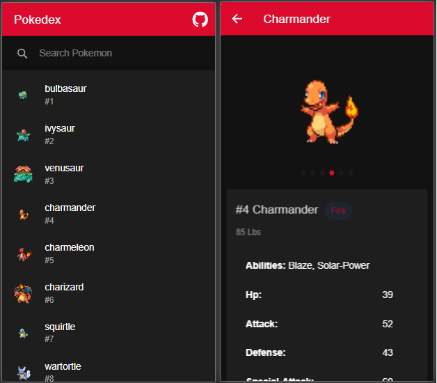

# PokedexIonic
[EN] Pokedex made with ionic framework. 
Pokedex is a list with data about all existing pokemon. 
[PT-BR] Pokedex feita com o framework ionic. 
Pokedex, é uma lista que contem informações sobre todos os pokemons existentes

Link: https://pokedex-ionic.netlify.app/

-------------------------------------------------
# Ionic framework
https://ionicframework.com/ 
[EN] version: 5 
install ionic with: npm install -g @ionic/cli 
To run the aplication: ionic serve 

[PT-BR] versão: 5 
instalar o ionic: npm install -g @ionic/cli 
para rodar a aplicação: ionic serve

------------------------------------------------

# Functionalities/Funcionalidades

[EN] The app shows a list of all pokemon ordered by number and if a pokemon is selected a page is loaded with all the information about that pokemon 

[PT-BR] A aplicação mostra uma lista de todos os pokemons ordenados por numero e se um pokemon é selecionado é carregada uma pagina com todas as informações do pokemon. 
